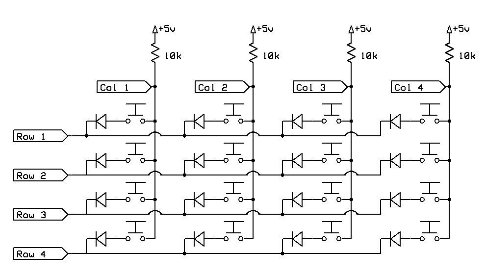

# arduino-pro-micro keyboard setup
## Introduction
In this repository there is some code for my custom keyboard. 

## Setup
I use an arduino pro micro, but I have to select Arduino Leonardo in the Arduino IDE. On Linux I also have to start the IDE as sudo in order to be able to connect to the device on the port. (There are
better ways, but I am lazy).

Then I have to 
- Go to Tools>Manage Libraries and install Keyboard for the code to work. 
- Go to Tools>Board>Board Manager and install Arduino AVR Boards to be able to select Arduino Leonardo.
- A restart of the IDE, then select board Arduino Leonardo, and Tools>Port>(...) (Leonardo)

## Wiring of the switches
### Basics - one key
See [reference](https://www.arduino.cc/en/Tutorial/BuiltInExamples/KeyboardMessage) for how to wire the keyswitch up.

In short: connect one end of the switch with 5v (VCC), and the other end to the input pin. The end of the switch that is connected to the input pin should also be connected to a 10K resistor that is 
in turn connected to ground. This will cause the input pin to be reliably low when not pressed, and high when pressed.

> When using a matrix, one such pulldown resistor is needed per input row/column. 

### Diode Matrix 
> I am currently waiting for my diodes to arrive, I will continue this write up when that happens.

